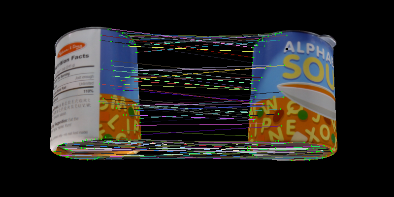

# keypoint matching between two renders of the same 3d models 

First generate the reference views of the 3d model. 
```
python generate_ref_views.py
```

Then you can visualize two views and see the 3d vertices how they align with different views. 

```
python make_match_random.py
```
This selects two random views, and then sample 10% of the union of the vertices and then displays them as follow: 
